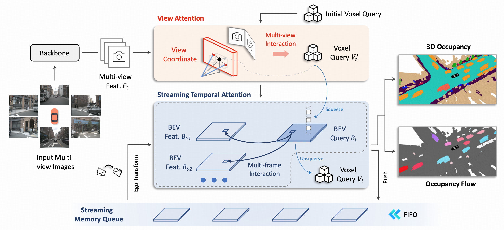

<div align="center">
<h2>ViewFormer: Multi-view 3D Motion Occupancy Prediction for Enhancing Dynamic Scene Representation</h2>
</div>

<video src="https://github.com/user-attachments/assets/a5856329-0210-4e3a-bbfb-16580e47ba9e" controls="controls" width="500" height="300"></video>

> **ViewFormer: Multi-view 3D Motion Occupancy Prediction for Enhancing Dynamic Scene Representation**, ECCV 2024
> - [Paper in arXiv](https://arxiv.org/abs/2405.04299) | [Blog in Chinese](https://zhuanlan.zhihu.com/p/706548179)

# News
- [2024/7/01]: 🚀 ViewFormer is accepted by **ECCV 2024**.
- [2024/5/15]: 🚀 ViewFormer rank **1st** on the occupancy trick of [RoboDrive Challenge](https://robodrive-24.github.io/)!


# Abstract

3D occupancy, an advanced perception technology for driving scenarios, represents the entire scene without distinguishing between foreground and background by quantifying the physical space into a grid map. The widely adopted projection-first deformable attention, efficient in transforming image features into 3D representations, encounters challenges in aggregating multi-view features due to sensor deployment constraints. To address this issue, we propose our learning-first view attention mechanism for effective multi-view feature aggregation. Moreover, we showcase the scalability of our view attention across diverse multi-view 3D tasks, including map construction and 3D object detection. Leveraging the proposed view attention as well as an additional multi-frame streaming temporal attention, we introduce ViewFormer, a vision-centric transformer-based framework for spatiotemporal feature aggregation. To further explore occupancy-level flow representation, we present FlowOcc3D, a benchmark built on top of existing high-quality datasets. Qualitative and quantitative analyses on this benchmark reveal the potential to represent fine-grained dynamic scenes. Extensive experiments show that our approach significantly outperforms prior state-of-the-art methods.

# Methods

<div align="center">
  
</div><br/>

<div align="center">
  
</div><br/>

## Getting Started

Please follow our documentations to get started.

1. [**Environment Setup.**](./docs/setup.md)
2. [**Data Preparation.**](./docs/data_preparation.md)
3. [**Training and Inference.**](./docs/training_inference.md)


## Results on [Occ3D](https://github.com/CVPR2023-3D-Occupancy-Prediction/CVPR2023-3D-Occupancy-Prediction/tree/main)(based on nuScenes) Val Set.
| Method | Backbone | Lr Schd | IoU|  Config | Download |
| :---: | :---: | :---: | :---: | :---: | :---: |
| ViewFormer | R50 | 90ep | 41.85 |[config](projects/configs/motionocc/motionocc_r50_704x256_seq_90e.py) |[model](https://drive.google.com/file/d/1MQtk_ZVaN0VoXxO_l8PzL1JENoTGg_Tb/view?usp=sharing)|

* More model weights will be released later.

**Notes**: 
- Since we do not adopt the CBGS setting, our 90-epoch schedule is equivalent to the 20-epoch schedule in FB-OCC, which utilizes CBGS to extend the training period by approximate 4.5 times.

## Acknowledgements

We are grateful for these great works as well as open source codebases.

* 3D Occupancy: [Occ3D](https://github.com/Tsinghua-MARS-Lab/Occ3D),
[OccNet](https://github.com/OpenDriveLab/OccNet),
[FB-OCC](https://github.com/NVlabs/FB-BEV).
* 3D Detection: [MMDetection3d](https://github.com/open-mmlab/mmdetection3d), [DETR3D](https://github.com/WangYueFt/detr3d), [PETR](https://github.com/megvii-research/PETR), [BEVFormer](https://github.com/fundamentalvision/BEVFormer),
[BEVDepth](https://github.com/Megvii-BaseDetection/BEVDepth),
[SOLOFusion](https://github.com/Divadi/SOLOFusion), [StreamPETR](https://github.com/exiawsh/StreamPETR).


Please also follow our visualization tool [Oviz](https://github.com/xiaoqiang-cheng/Oviz), if you are interested in the visualization in our paper.


## Bibtex
If this work is helpful for your research, please consider citing the following BibTeX entry.
```
    @article{li2024viewformer,
        title={ViewFormer: Exploring Spatiotemporal Modeling for Multi-View 3D Occupancy Perception via View-Guided Transformers}, 
        author={Jinke Li and Xiao He and Chonghua Zhou and Xiaoqiang Cheng and Yang Wen and Dan Zhang},
        journal={arXiv preprint arXiv:2405.04299},
        year={2024},
    }
```
